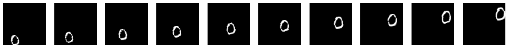

torch_moving_mnist
================

<!-- WARNING: THIS FILE WAS AUTOGENERATED! DO NOT EDIT! -->

## Install

``` sh
pip install -e .
```

## How to use

``` python
from torch_moving_mnist.data import MovingMNIST
from torch_moving_mnist.utils import show_images
```

``` python
affine_params = dict(
    angle=(-20, 20), # rotation in degrees (min and max values)
    translate=((-30, 30), (-30, 30)), # translation in pixels x and y
    scale=(.8, 1.3), # scaling in percentage (1.0 = no scaling)
    shear=(-20, 20), # deformation on the z-plane
)
```

Create a MovingMNIST dataset with `affine_params`, with 10 frames and
may include up to 3 digitis. Image size is 64.

``` python
from nbdev.showdoc import show_doc
```

------------------------------------------------------------------------

<a
href="https://github.com/tcapelle/torch_moving_mnist/blob/main/torch_moving_mnist/data.py#LNone"
target="_blank" style="float:right; font-size:smaller">source</a>

### MovingMNIST

>      MovingMNIST (path='.', affine_params:dict=namespace(angle=(-20, 20),
>                   translate=((-30, 30), (-30, 30)), scale=(0.8, 1.3),
>                   shear=(-20, 20)), num_digits:list[int]=[3],
>                   num_frames:int=4, img_size=64, concat=True, normalize=True)

Initialize self. See help(type(self)) for accurate signature.

|               | **Type** | **Default**                                                                                     | **Details**                                                                                                                                         |
|---------------|----------|-------------------------------------------------------------------------------------------------|-----------------------------------------------------------------------------------------------------------------------------------------------------|
| path          | str      | .                                                                                               | path to store the MNIST dataset                                                                                                                     |
| affine_params | dict     | namespace(angle=(-20, 20), translate=((-30, 30), (-30, 30)), scale=(0.8, 1.3), shear=(-20, 20)) | affine transform parameters, refer to torchvision.transforms.functional.affine                                                                      |
| num_digits    | list     | \[3\]                                                                                           | how many digits to move, random choice between the value provided                                                                                   |
| num_frames    | int      | 4                                                                                               | how many frames to create                                                                                                                           |
| img_size      | int      | 64                                                                                              | the canvas size, the actual digits are always 28x28                                                                                                 |
| concat        | bool     | True                                                                                            | if we concat the final results (frames, 1, 28, 28) or a list of frames.                                                                             |
| normalize     | bool     | True                                                                                            | scale images in \[0,1\] and normalize them with MNIST stats. Applied at batch level. Have to take care of the canvas size that messes up the stats! |

``` python
ds = MovingMNIST(affine_params=affine_params, num_frames=10, num_digits=[1,2,3], img_size=64)
```

    New computed stats for MovingMNIST: ([0.07522265625], [0.17685937499999999])

when you index the dataset, it generates a random set of MNIST digits
and trajectories. You could basically only call `ds[0]`

``` python
sequence = ds[0]
```

``` python
show_images(sequence, figsize=(20,10))
```



``` python
t = sequence
type(t), t.shape
```

    (torch.Tensor, torch.Size([10, 1, 64, 64]))

## Dataloader

This dataset is randomly creating sequences on the fly, so the
dataloader is just going to generate a batch…

``` python
batch = ds.get_batch(bs=128)
```

``` python
batch.shape
```

    torch.Size([128, 10, 1, 64, 64])

``` python
show_images(batch[0])
```


the dataloader also is normalizing the inputs for you, after
constructing the batch.

``` python
ds.batch_tfms
```

    Compose(
        ConvertImageDtype()
        Normalize(mean=[0.07522265625], std=[0.17685937499999999])
    )
