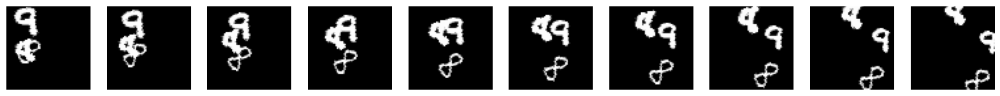

torch_moving_mnist
================

<!-- WARNING: THIS FILE WAS AUTOGENERATED! DO NOT EDIT! -->

## Install

``` sh
pip install -e .
```

## How to use

Fill me in please! Don’t forget code examples:

``` python
from torch_moving_mnist.data import MovingMNIST
from torch_moving_mnist.utils import show_images
```

``` python
affine_params = dict(
    angle=(-20, 20), # rotation in degrees (min and max values)
    translate=((-30, 30), (-30, 30)), # translation in pixels x and y
    scale=(.8, 1.3), # scaling in percentage (1.0 = no scaling)
    shear=(-20, 20), # deformation on the z-plane
)
```

Create a MovingMNIST dataset with `affine_params`, with 10 frames and
may include up to 3 digitis. Image size is 64.

``` python
ds = MovingMNIST(affine_params=affine_params, n=10, num_digits=[1,2,3], img_size=64)
```

when you index the dataset, it generates a random set of MNIST digits
and trajectories. You could basically only call `ds[0]`

``` python
sequence = ds[0]
```

``` python
show_images(sequence, figsize=(20,10))
```



``` python
t = sequence
type(t), t.shape
```

    (torch.Tensor, torch.Size([10, 1, 64, 64]))

## Dataloader

A simple dataloader would be something like:

``` python
import torch
```

``` python
def get_batch(bs=128):
    return torch.stack([ds[0] for _ in range(bs)])
```

``` python
b = get_batch()
b.shape
```

    torch.Size([128, 10, 1, 64, 64])
