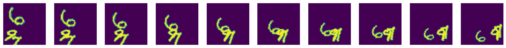

torch_moving_mnist
================

<!-- WARNING: THIS FILE WAS AUTOGENERATED! DO NOT EDIT! -->

## Install

``` sh
pip install torch_moving_mnist
```

## How to use

Fill me in please! Don’t forget code examples:

``` python
from torch_moving_mnist.utils import show_images
from torchvision.datasets import MNIST

path = "."

#from torchvision
mnist_dataset = MNIST(path, download=True)
```

``` python
affine_params = dict(
    angle=(-20, 20),
    translate=((-30, 30), (-30, 30)),
    scale=(.8, 1.3),
    shear=(-20, 20),
)
```

Create a MovingMNIST dataset with `affine_params`, with 10 frames and
may include up to 3 digitis. Image size is 64.

``` python
ds = MovingMNIST(mnist_dataset, affine_params=affine_params, n=10, num_digits=[1,2,3], img_size=64)
```

``` python
show_images(ds[0], figsize=(20,10))
```


